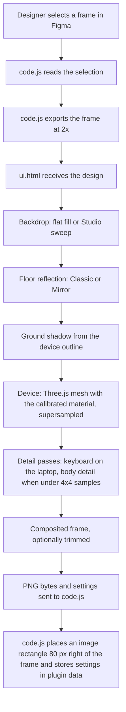

Klinos is two programs that talk by messages. This split is the same as in V2, and mixing them up is the most common error.

## The two halves

| | `code.js` | `ui.html` |
|---|---|---|
| Runs in | Figma's main thread (the plugin sandbox) | The plugin's iframe |
| Can see | The Figma document | Pixels: WebGL, Three.js, canvas 2D |
| Can't see | Pixels or the DOM | The Figma file |
| Does | Watches the selection, exports the frame at 2x, places or refreshes the mockup, stores settings with `setPluginData`, keeps per-user preferences in `clientStorage` | Renders the preview and the final image, sends PNG bytes and settings back |

`figma is not defined` means main-thread code ended up in the iframe. `document is not defined` means the reverse.

`code.js` is V2's main thread with its message protocol kept. It never knew how the pixels were made.

## Messages

**From the UI to `code.js`:** `ready`, `mode`, `insert`, `plInsert`, `plInsertLayers`, `plExport`, `plExplode`, `layout`, `theme`, `cardOrder`.

**From `code.js` to the UI:** `source`, `empty` (with a reason to show), `inserted`, `plSelection`, `plItem`, `plExplodeInfo`, `plExplodeCard`, `layout`, `theme`, `cardOrder`.

Playground sync and export requests carry a sequence number. Stale replies are dropped on both sides.

## Where things live

| What | Where |
|---|---|
| Device shapes and finishes | `DEVICES` in `src/ui.html`, together with the constants in each device shader |
| Device shading (the calibrated material) | `src/shaders/<device>.glsl`: `phone.glsl` (iPhone 13), `phone17.glsl`, `galaxy.glsl`, `laptop.glsl`, `tablet.glsl` |
| Mesh building | `buildPhone13()`, `buildPhone17()`, `buildLaptop()`, `buildTablet()` in `src/ui.html`, from the shaders' own constants |
| Backdrop and sweep | `src/shaders/backdrop.glsl` |
| Playground cards | `src/shaders/card.glsl` |
| Staging props | `src/shaders/prop.glsl` (unreleased feature) |
| Looks | `LOOKS` in `src/ui.html` |
| Photoreal renders | `src/assets/*.b64` and `src/assets/photoreal.json`, generated from `reference/photoreal/` |
| What lands on the Figma canvas | `code.js` |

The V2 source shaders in `reference/v2/` are the calibration source of truth. `tools/port_v2_shaders.py` turns them into `src/shaders/` with a short list of asserted edits.

## Render pipeline: from frame to canvas

The preview and the export call the same `renderFrame` function, so the preview is exactly what gets inserted.

## The four layers of a frame

1. **Backdrop.** A flat fill, or the Studio sweep from `backdrop.glsl`. Transparent skips it.
2. **Floor reflection.** Sweep only. Classic is V2's, inside the backdrop shader. Mirror renders the real mesh mirrored about the ground.
3. **Ground shadow.** V2's `castToGround`, `convexHull` and `paintShadow`, from the device's 3D outline.
4. **Device.** The Three.js mesh with the device material, on a transparent background, supersampled and tiled past the GPU's size limit.

A settled preview or an export takes 4x4 samples a pixel when the frame fits the budget, otherwise 2x2. A draft takes 2x2 or 1. When the main render had fewer than 4x4 samples, a body detail pass re-renders the device's outline box at 4x4 and replaces the main layer there. The laptop also gets a keyboard detail pass.

## Photoreal and Playground

- **Photoreal** doesn't use the 3D devices. `renderPhotoreal` draws in 2D canvas: backdrop, a blurred silhouette shadow, the design in the screen rectangle clipped by the mask, then the body.
- **Playground** uses its own scene and camera on the shared renderer, with `card.glsl`. It never touches the device groups or any calibrated value. In Playground, `code.js` reads the whole selection, and the UI asks for each layer's pixels with `plExport`.

## Output size

The base height is 1080 px (the iPad twice that, the MacBook three times), times 1x, 2x or 4x, with the longest side capped at 4096 because `figma.createImage` refuses more. The multiplier actually used goes back with the bytes, and `code.js` divides by it to size the rectangle.
